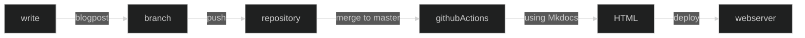

# Automating Your Developer Blog with Mkdocs and Github Actions

As developers, we're passionate about writing code, sharing knowledge, and staying up-to-date with the latest tech trends. But let's face it: managing a blog can be a headache. Themes, styles, meta information—ugh! Wouldn't it be great if we could focus on content without the fuss?

## The Past: Markdown and CMS Woes

Years ago, I discovered Markdown—a clean, efficient way to format my notes and documentation. But my personal note-taking in Obsidian remained separate from my blog. Enter Grav CMS, which supported Markdown but fell short in the template department. Every time I tried a new theme, it was either a configuration nightmare or an outright installation failure.

## The Present: Mkdocs Material to the Rescue

Today, I've made a decision: I want to blog like a developer. No more CEO-friendly CMS. No more manual configurations. I want to create and deploy my blog automatically. So, I turned to Mkdocs Material. With Mkdocs, I can focus on writing, not theming.

**Why Mkdocs Material?**: Mkdocs Material is a fantastic choice for developer blogs. It provides a clean, responsive design out of the box, allowing you to focus on your content rather than wrestling with themes.

### The Extras I Added

#### Syntax Highlighting

As developers, we love code snippets. So, I enabled syntax highlighting for various languages:

```yaml
highlightjs: true
hljs_languages:
  - bash
  - python
  - yaml
  - json
  - golang
  - javascript
  - html
  - php
```

#### Dark and Light Mode

My eyes demand a dark mode. Here's how I added it:

```yaml
palette:
  - media: "(prefers-color-scheme: light)"
    scheme: default
    primary: indigo
    accent: light-blue
    toggle:
      icon: material/toggle-switch-off-outline
      name: Switch to dark mode
  - media: "(prefers-color-scheme: dark)"
    scheme: slate
    primary: black
    accent: deep orange
    toggle:
      icon: material/toggle-switch
      name: Switch to light mode
```

#### Markdown Magic

I wanted more than plain Markdown. So, I added two extensions:

1. **Checkbox Syntax**: Now I can create nice HTML checkboxes:

   - [ ] unchecked
   - [x] checked

2. **Mermaid JS Diagrams**: Mkdocs now renders Mermaid JS diagrams seamlessly.

```yaml
markdown_extensions:
  - pymdownx.tasklist:
      custom_checkbox: true
  - pymdownx.superfences:
      custom_fences:
        - name: mermaid
          class: mermaid
          format: !!python/name:pymdownx.superfences.fence_code_format
```

## The Future: GitHub Actions and Beyond

My journey doesn't end here. I'm planning to automate deployment using GitHub Actions. Writing should be as smooth as coding:



Stay tuned for more developer-centric content as my blog evolves! 🚀

---

**Additional Information:**

- **GitHub Actions for Deployment**: Automating deployment with GitHub Actions is a game-changer. Imagine writing a new blog post, pushing it to your repository, and having it automatically build and deploy to your web server. No manual steps, no fuss.

- **Mermaid JS Diagrams**: Mermaid JS lets you create flowcharts, sequence diagrams, and more directly in your Markdown. It's like magic for visualizing complex ideas.

- **Dark Mode FTW**: As developers, we spend countless hours staring at screens. Dark mode isn't just a trend; it's a necessity. Now my blog respects my eyes' preferences.

Remember, fellow devs: Write, automate, and code on! 🤓👩‍💻👨‍💻

